# 3D reconstruction of a mouse CT

## Introduction
A CT scan or computed tomography scan (formerly known as computed axial tomography or CAT scan) is a medical imaging technique used in radiology to get detailed images of the body noninvasively for diagnostic purposes.

CT scanners use a rotating x-ray tube and a row of detectors placed in the gantry to measure X-ray attenuations by different tissues inside the body. The multiple X-ray measurements taken from different angles are then processed on a computer using reconstruction algorithms to produce tomographic (cross-sectional) images (virtual "slices") of a body [1].

Here, Filtered Back-projection algorithm is used to recontruct the 3D volume from the mentioned collection of X-ray measurements, or Sinograms, also known in mathematics as the **Radon transform** [2], an example of the 2D object Phantom and its Sinogram can be seen in Fig. 1.

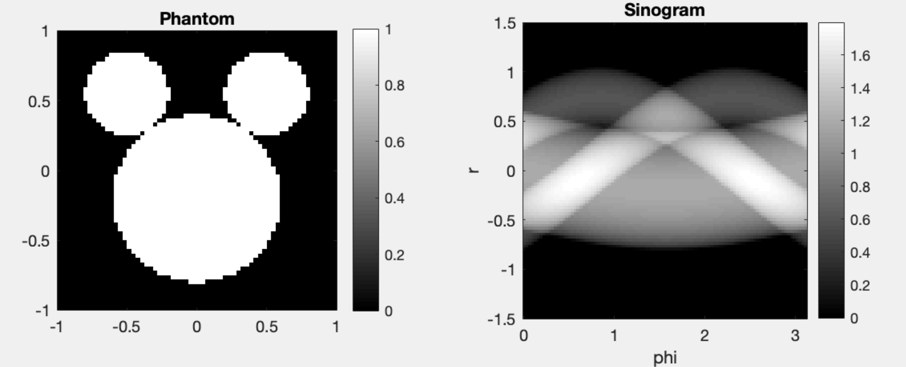

Fig. 1. Radon transoform of Phantom image.

## Reconstruction
The data file *'./data/mouse.tif'* contains a 3D sinogram that is used to reconstruct a 3D volume of the mouse, the steps followed are (1) extract 2D sinograms, (2) reconstruct each 2D sinogram, (3) stack the 2D reconstructions to form a reconstructed 3D folume, (4) generate a video of the 3D volume recontructed.

### Exploring the data *(mouse.tif)*

We use slice 201 as a reference to check our results with the ground truth (*'./data/mouse_vol.tif'*). We also use **UCSF Chimera** and **ImageJ** to explore the *.tif* files.
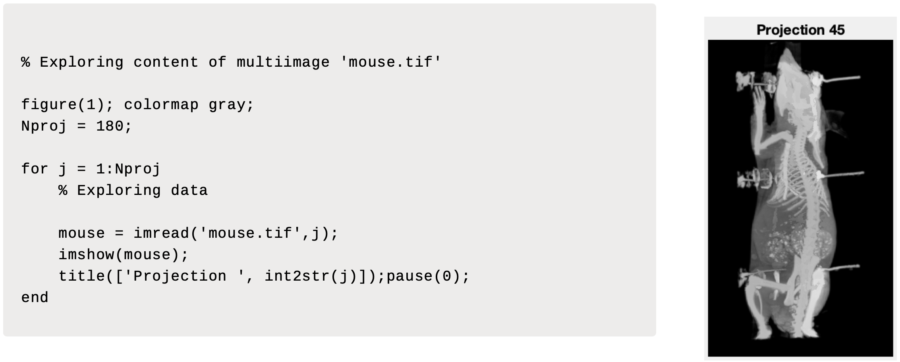

Fig. 2. Visualization of projeciton 45.

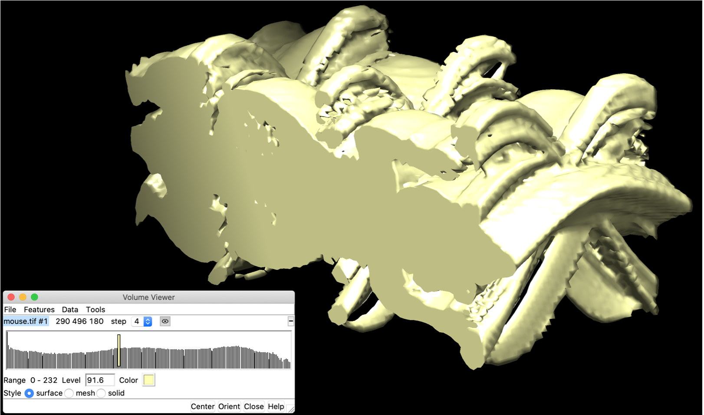

Fig. 3. Chimera visualization of *mouse.tif*.

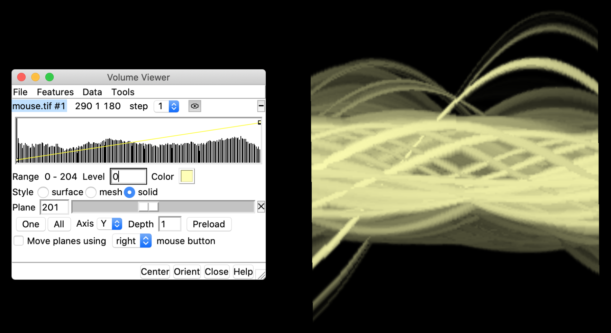

Fig. 4. Slice 201 of *mouse.tif* using Chimera.

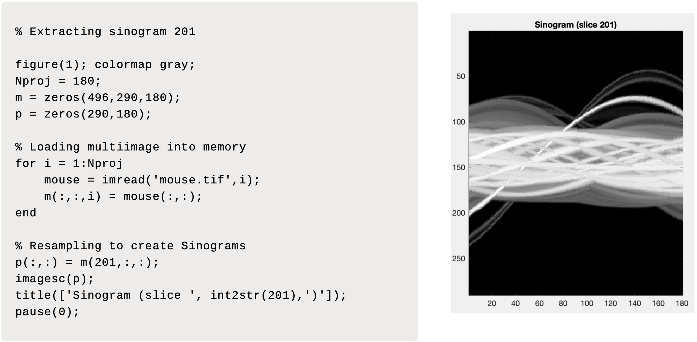

Fig. 5. Extraction of sinogram 201 from *mouse.tif*.

## 2D Reconstruction of slice 201.
Fig. 6 shows the filtered back-projection of sinogram 201 extracted from *moise.tif*. We can see the ground truth of in Fig. 7, which is visualized using **ImageJ**.

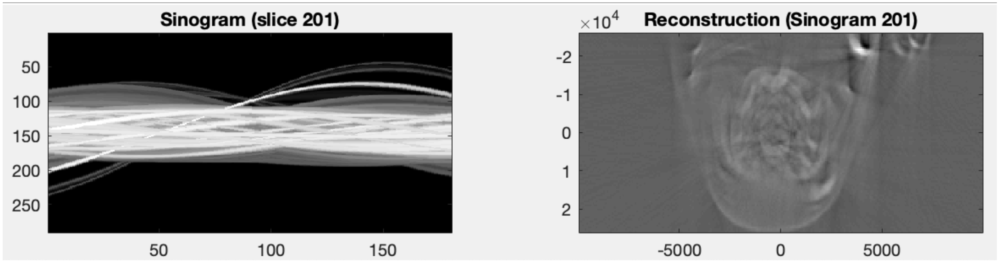

Fig. 6. Extraction of sinogram 201 from *mouse.tif*.

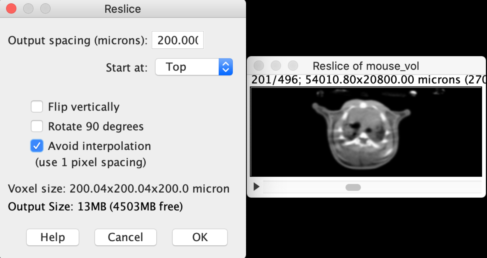

Fig. 7. Extraction of sinogram 201 from *mouse.tif*.

## 3D Reconstruction of the whole volume

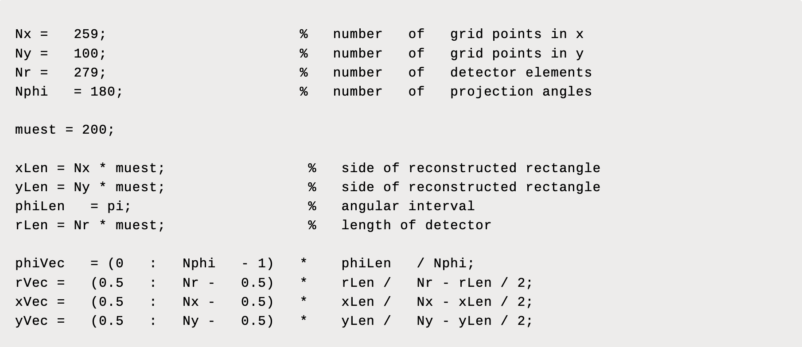
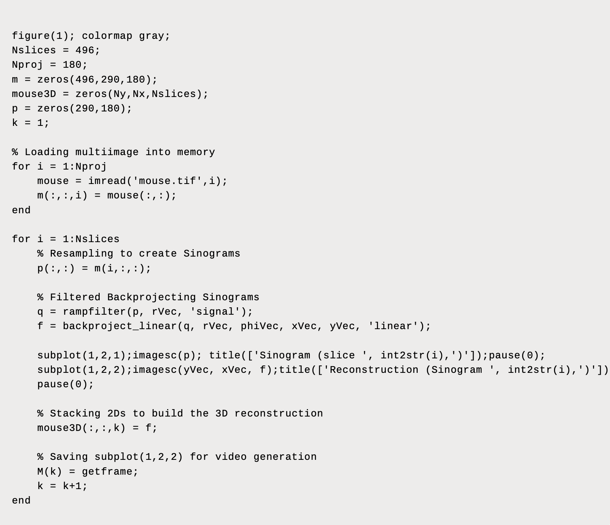

Fig. 8. 3D reconstruction main loop and parameter setting.

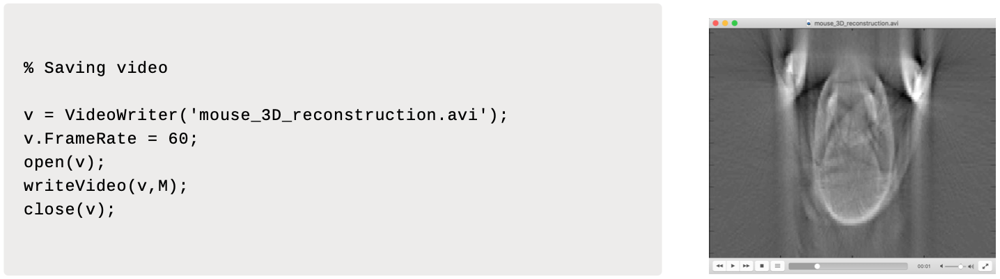

Fig. 9. Video generation of reconstruction.

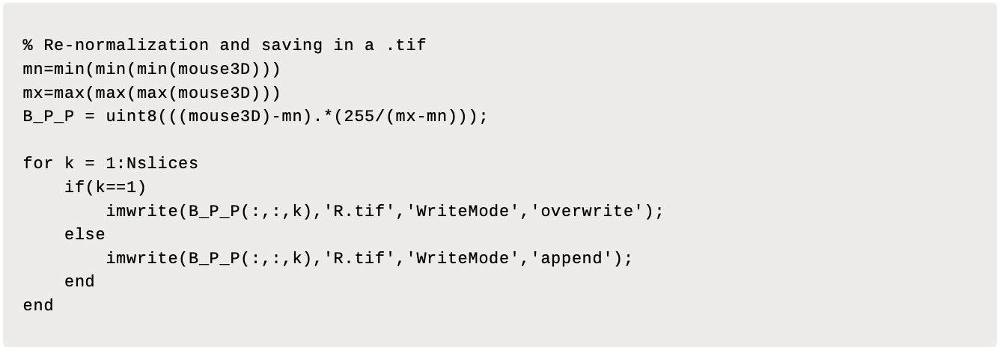

Fig. 10. Re-normalization of values to visualize reconstruction with Chimera.

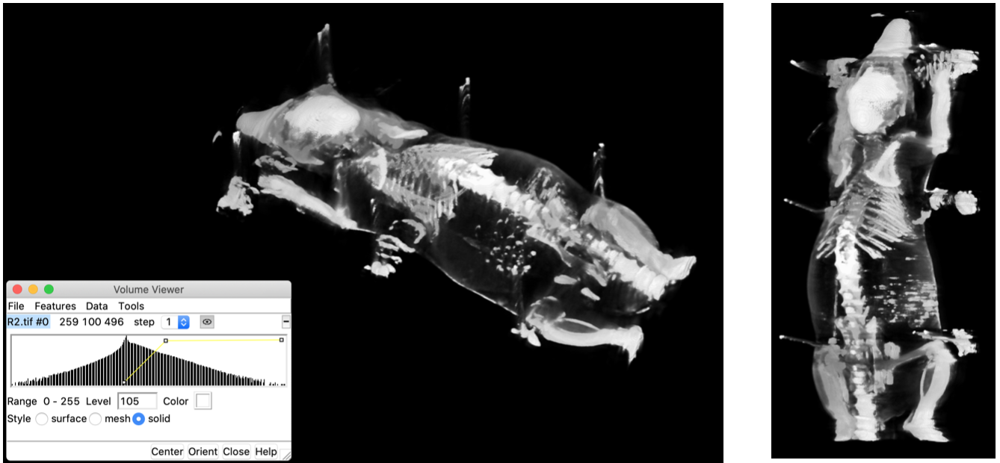

Fig. 11. Visualization of results using Chimera.

## Cite this work
    J. Rico (2019) 3D reconstruction of mouse Computed Tomography using Filtered Back-projection.
    [Source code](https://github.com/jvirico/mouse_CT_3D_reconstruction)

## References and Resources
[1] - X-ray computed tomography as used in medicine. [CT Scan](https://en.wikipedia.org/wiki/CT_scan).\
[2] - Sinogram. [Radon Transform](https://en.wikipedia.org/wiki/Radon_transform).\